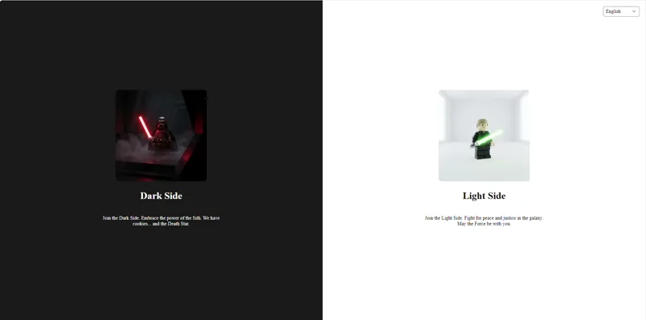

# Vaadin 25 Star Wars Demo Application

A modern small demo application built with Vaadin 25 and Spring Boot, demonstrating advanced UI concepts, dynamic scheming dark/light mode, and full internationalization within a Star Wars-themed context.



### 🌐 Live Demo
Check out the live application here: [https://starwars.gladtek.com/](https://starwars.gladtek.com/)

> **Note**: This demo is hosted on Render's free tier. If the application has been inactive for a while, it may take a minute to wake up. Please be patient! ⏳
## How to Run

### Prerequisites
*   JDK 21
*   Maven 3.x

### Run locally

```bash
mvn clean spring-boot:run
```

Open [http://localhost:8080](http://localhost:8080) in your browser.

## 1. Functional Features

### Entry & Navigation
*   **Split Screen Entry**: A unique landing page requiring users to choose their path: "Light Side" or "Dark Side".
*   **User Identity**: In this demo, a user is defined not by a login, but uniquely by their choice of side (Dark/Light).
*   **Deep Linking**: Smart redirection ensures that if you access a specific link (e.g., `/planets`) before logging in, you are automatically taken there after selecting your side.
*   **Persistent Navigation**: A responsive side drawer navigation menu available throughout the application.

### Core Modules
*   **Dashboard**: A responsive dashboard overview with key performance indicators (KPIs).
*   **Planets**:
    *   Interactive data grid displaying Star Wars planets.
    *   **Master-Detail View**: Select a planet to see full details in a split-view layout.
    *   **Localized Data**: Planet names, climates, and terrains are fully translated.
*   **Components Showcase**: A comprehensive gallery of customized Vaadin components:
    *   **Inputs**: Text fields, date pickers (with localized "Today"/"Cancel" buttons), time pickers.
    *   **Cards**: Standard cards and advanced variants with media images, badges, and footer actions.
    *   **Display**: Grids, Tabs, Accordions, and Dialogs.

### Internationalization (i18n)
*   **Multi-language Support**: Full support for **English**, **French**, **German**, and **Arabic**.
*   **RTL Support**: Automatic Right-to-Left (RTL) layout adjustment when switching to Arabic.
*   **Localized Components**: All UI elements, including complex components like the `DatePicker` (months, weekdays, buttons), are dynamically localized.

### Theming & UX
*   **Dynamic Theme Switching**: Seamlessly switch between **Lumo** (Default) and **Aura** themes.
*   **Side-based Styling**: The application's visual density and color palette adapt based on the user's initial "Light" or "Dark" side selection.
*   **404 Page**: A custom, localized "Page Not Found" experience that guides users back to safety.

---

## 2. Technical Overview

### Technology Stack
*   **Framework**: Vaadin Flow 25.0.3
*   **Backend**: Spring Boot 4.0.1 (Java 21)
*   **Build Tool**: Maven

### Architecture & Patterns
*   **Layout Architecture**:
    *   `MainLayout`: Implements `AppLayout` for the global shell, handling navigation and global theme/locale state.
    *   `SplitScreenView`: The entry point managing the initial user decision.
*   **Session Management**:
    *   `UserSession` (`@VaadinSessionScope`): Manages user state (Selected Side, Active Theme, Intended Route) across the session lifecycle.
*   **Security & Routing**:
    *   **Anonymous Access**: Views are annotated with `@AnonymousAllowed` (demo mode).
    *   **Route Guards**: `MainLayout` implements `BeforeEnterObserver` to intercept unauthenticated users (no side selected) and redirect them to the entry page, effectively protecting inner views while preserving deep links via `UserSession.intendedRoute`.
    *   **Error Handling**: `NotFoundView` implements `HasErrorParameter<NotFoundException>` to catch and display 404 errors.

### Key Components & Utilities
*   **`DatePickerI18nUtil`**: A specialized utility that generates `DatePicker.DatePickerI18n` configurations dynamically from the active `Locale`, handling specific formats (e.g., `ar-TN` for Arabic) and loading translation resources.
*   **`LanguageHelper`**: Centralized logic for determining layout direction (`Direction.RIGHT_TO_LEFT` vs `LEFT_TO_RIGHT`) based on the language.
*   **`ComponentsView`**: A modular "Kitchen Sink" view demonstrating component customization. It is refactored into distinct sections for better maintainability:
    *   `InputSection`: Text fields, DatePickers, etc.
    *   `ButtonSection`: Button variants, responsive icon button rows, custom spacers, and styles replacing Lumo variables.
    *   `SelectionSection`: ComboBoxes, Selects, Radios.
    *   `DisplaySection`: Grids, Tabs, Accordions.
    *   `CardSection`: Standard and advanced Cards.
    *   `DialogSection`: Dialogs and Notifications.

### Localization Structure
*   Resources stored in `src/main/resources/vaadin-i18n/`.
*   Standard properties files: `translations.properties` (fallback), `_en`, `_fr`, `_de`, `_ar`.
*   Keys follow a structured naming convention (e.g., `components.datepicker.today`, `error.404.title`).

## 3. Containerization & Deployment

### Optimized Docker Build
The project includes a sample `Dockerfile`:
*   **Multi-Stage Build**: Uses a robust `maven` image for building and a lightweight `alpine` JRE for running.
*   **Layer Caching**: `pom.xml` is copied and dependencies downloaded *before* source code, allowing Docker to cache the heavy dependency layer.
*   **Buildkit Caching**: Leverages `--mount=type=cache` to speed up Maven builds.

### CI/CD Workflow
*   **Github Actions**: Automated pipeline driven by a local `version.json` file.
*   **Version Control**: The `version.json` controls the image tag and whether to push to the registry, giving granular control over release management.
*   **Secrets**: To enable deployment, set up `DOCKER_USERNAME` and `DOCKER_PASSWORD` in your GitHub Repository Secrets.
